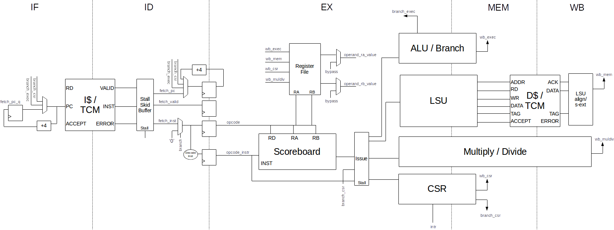
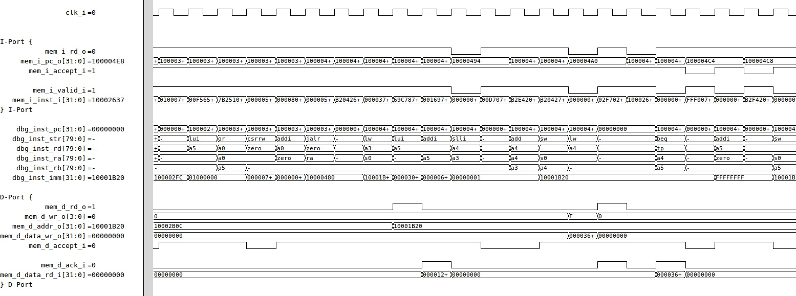

# RISC-V Core

Github: http://github.com/ultraembedded/riscv

A 32-bit RISC-V core written in Verilog and an instruction set simulator supporting RV32IM.  
This core has been tested against a co-simulation model and exercised on FPGA.

**For a better tested, higher performance core which boots Linux, see my latest RISC-V core here;**
[http://github.com/ultraembedded/biriscv](http://github.com/ultraembedded/biriscv)

## Overview


## Directories

| Name                | Contents                                            |
| ------------------- | --------------------------------------------------- |
| core/rv32i          | RISC-V pipelined RV32I CPU core (Verilog)           |
| core/rv32i_spartan6 | RISC-V pipelined RV32I optimised for small Spartan6 |
| core/rv32im         | RISC-V pipelined RV32IM CPU core (Verilog)          |
| isa_sim             | Instruction set simulator (C)                       |
| top_tcm_axi/src_v   | Example instance with 64KB DP-RAM & AXI Interfaces  |
| top_tcm_axi/tb      | System-C testbench for the core                     |
| top_cache_axi/src_v | Example instance with instruction and data caches.   |
| top_cache_axi/tb    | System-C testbench for the core                     |

## Core

The core (riscv_core) contains;
* RV32I or RV32IM support depending on core variant.
* 5-stage in-order, single issue.
* Modified Harvard architecture.
* Custom bus interfaces which can be connected directly to either RAM or Instruction / Data cache.
* Coremark:  **3.14 CoreMark/MHz**
* Dhrystone: **1.35 DMIPS/MHz** ('legal compile options' / 337 instructions per iteration)

## Example Core Instance (with TCM memory)

The top (top_tcm_axi/src_v/riscv_tcm_top.v) contains;
* Instances one of the above cores, adding RAM and standard bus interfaces.
* 64KB dual ported RAM for (I/D code and data).
* AXI4 slave port for loading the RAM, DMA access, etc (including support for burst access).
* AXI4-Lite master port for CPU access to peripherals.
* Separate reset for CPU core to dual ported RAM / AXI interface (to allow program code to be loaded prior to CPU reset de-assertion).

### Memory Map

| Range                     | Description                                         |
| ------------------------- | --------------------------------------------------- |
| 0x0000_0000 - 0x0000_ffff | 64KB TCM Memory                                     |
| 0x0000_2000               | Boot address (configurable, see RISCV_BOOT_ADDRESS) |
| 0x8000_0000 - 0xffff_ffff | Peripheral address space (from AXI4-L port)         |

### Interfaces

| Name         | Description                                                           |
| ------------ | --------------------------------------------------------------------- |
| clk_i        | Clock input                                                           |
| rst_i        | Async reset, active-high. Reset memory / AXI interface.               |
| rst_cpu_i    | Async reset, active-high. Reset CPU core (excluding AXI / memory).    |
| axi_t_*      | AXI4 slave interface for access to 64KB TCM memory.                   |
| axi_i_*      | AXI4-Lite master interface for CPU access to peripherals.             |
| intr_i       | Active high interrupt input (for connection external int controller). |

### Testbench

A basic System-C / Verilator based testbench for the core is provided.

Dependencies;
* gcc
* make
* libelf
* System-C (specify path using SYSTEMC_HOME)
* Verilator (specify path using VERILATOR_SRC)

To build the testbench;
```
cd top_tcm_axi/tb
make
````

To run the provided test executable;
```
cd top_tcm_axi/tb
make run
````

## Example Core Instance (with caches)

The top (top_cache_axi/src_v/riscv_top.v) contains;
* Instances one of the above cores, adding RAM and standard bus interfaces.
* 16KB 2-way set associative instruction cache
* 16KB 2-way set associative data cache with write-back and allocate on write.
* 2 x AXI4 master port for CPU access to instruction / data / peripherals.

### Interfaces

| Name           | Description                                                           |
| -------------- | --------------------------------------------------------------------- |
| clk_i          | Clock input                                                           |
| rst_i          | Async reset, active-high. Reset memory / AXI interface.               |
| axi_i_*        | AXI4 master interface for CPU access to instruction memory.           |
| axi_d_*        | AXI4 master interface for CPU access to data / peripheral memories.   |
| intr_i         | Active high interrupt input (for connection external int controller). |
| reset_vector_i | Boot vector.                                                          |

## Execution Example

